# Project 02 - Enterprise Active Directory

## Overview

This project builds upon the Azure infrastructure created in Project 01 by deploying an Enterprise Active Directory environment using Windows Server 2022. The server was promoted to a Domain Controller, providing centralized identity and access management for users, Organizational Units (OUs), and administrative resources within the lab environment.

PowerShell automation was also introduced to simplify common administrative tasks such as bulk user creation, home folder configuration, and Active Directory reporting.

---

# Objectives

- Install Active Directory Domain Services (AD DS)
- Promote Windows Server 2022 to a Domain Controller
- Configure an Active Directory domain
- Create Organizational Units (OUs)
- Create enterprise user accounts
- Automate administration using PowerShell
- Configure user home folders
- Generate Active Directory reports

---

# Environment

| Component | Configuration |
|-----------|---------------|
| Operating System | Windows Server 2022 Datacenter |
| Server Name | DC01 |
| Server Role | Domain Controller |
| Services | Active Directory Domain Services |
| Management Console | Active Directory Users and Computers |
| Automation | Windows PowerShell |

---

# Architecture

Windows Server 2022 was promoted to a Domain Controller and configured as the central identity management server for the enterprise lab environment. Organizational Units were created to organize users, while PowerShell automation simplified repetitive administrative tasks.

---

# Implementation

## 1. Active Directory Domain Services Installation

The Active Directory Domain Services (AD DS) role was successfully installed using Server Manager.

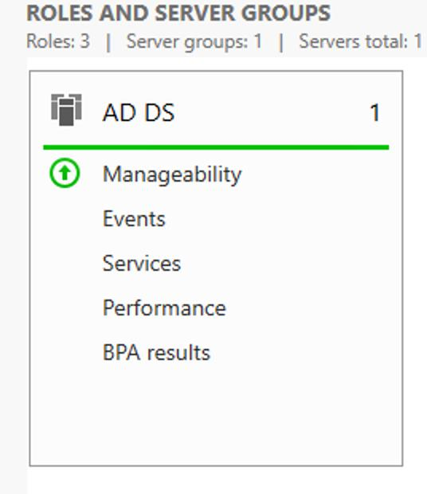

---

## 2. Domain Controller Promotion

The Windows Server was promoted to a Domain Controller by creating a new Active Directory forest and domain.

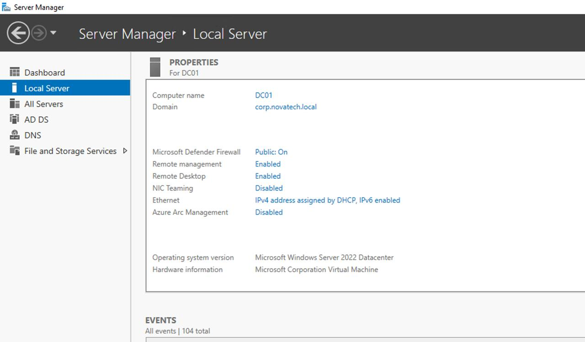

---

## 3. AD DS Management

After promotion, Server Manager confirmed that Active Directory Domain Services had been successfully installed.

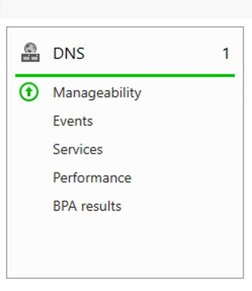

---

## 4. Active Directory Users and Computers

The Active Directory Users and Computers (ADUC) console was used to manage users and Organizational Units.

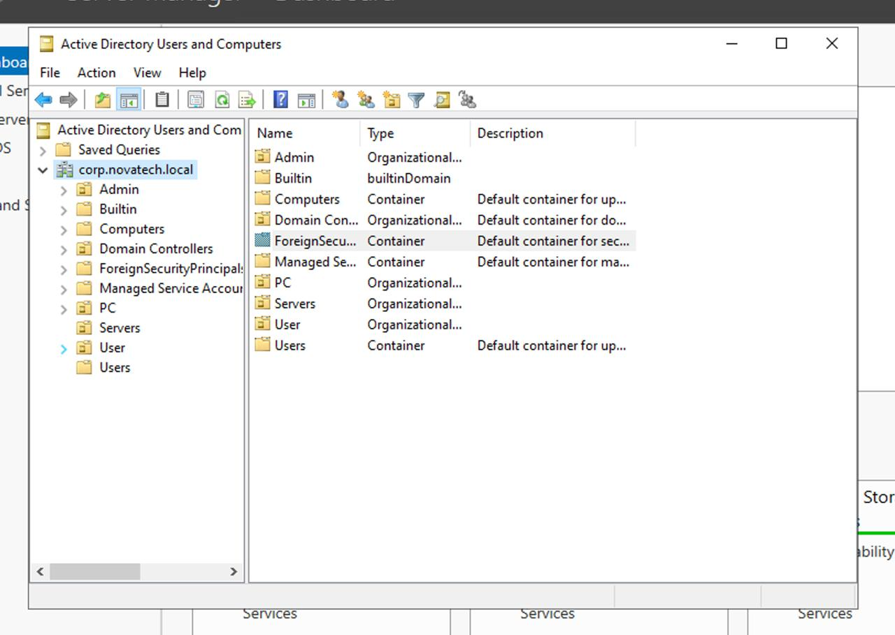

---

## 5. Organizational Units

Organizational Units (OUs) were created to logically separate administrative objects and simplify management.

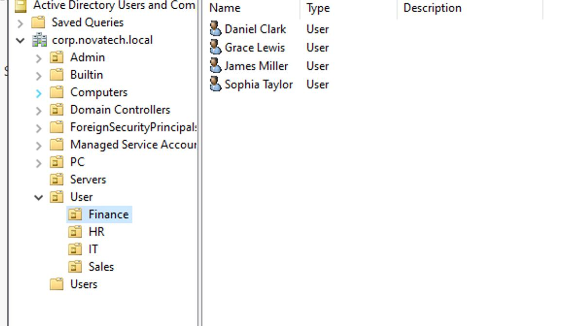

---

## 6. User Accounts

Enterprise user accounts were created and organized within the appropriate Organizational Units.

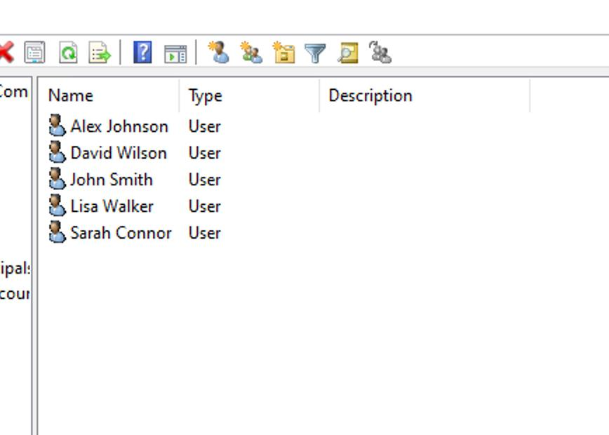

---

# PowerShell Administration

PowerShell was used to verify Active Directory objects and automate common administrative tasks.

## Active Directory Users

The following command was used to retrieve Active Directory users.

```powershell
Get-ADUser -Filter *
```

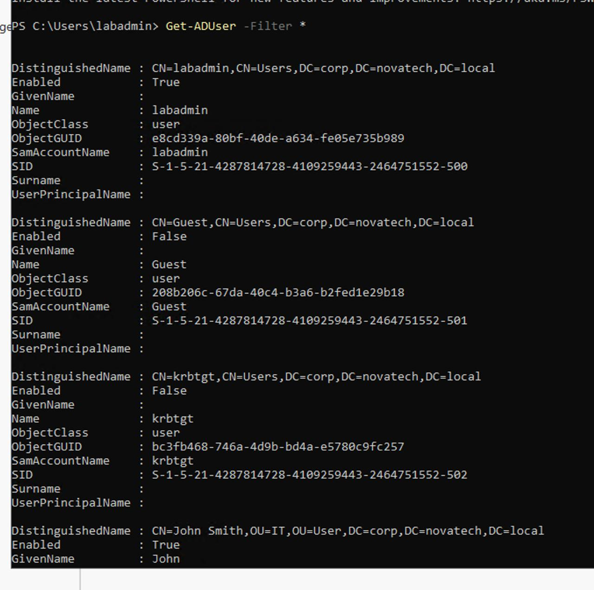

---

## Active Directory Groups

The following command was used to list Active Directory groups.

```powershell
Get-ADGroup -Filter *
```

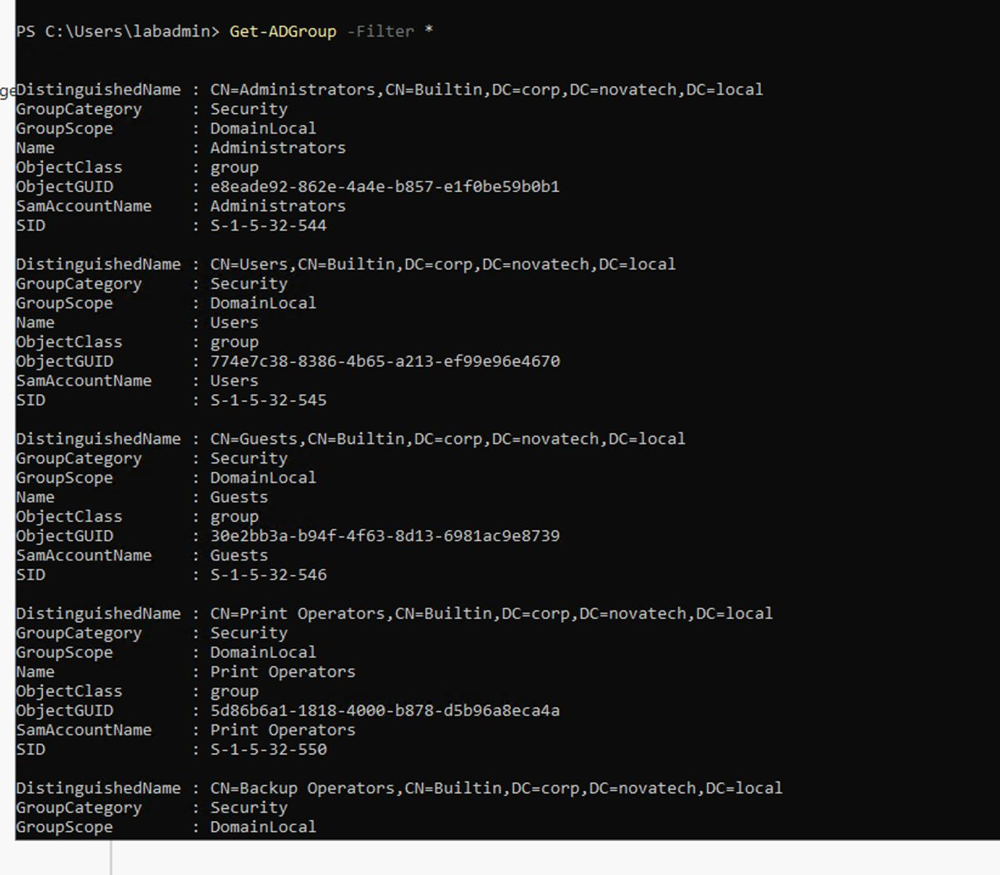

---

## Organizational Units

The following command displayed all Organizational Units within the domain.

```powershell
Get-ADOrganizationalUnit -Filter *
```

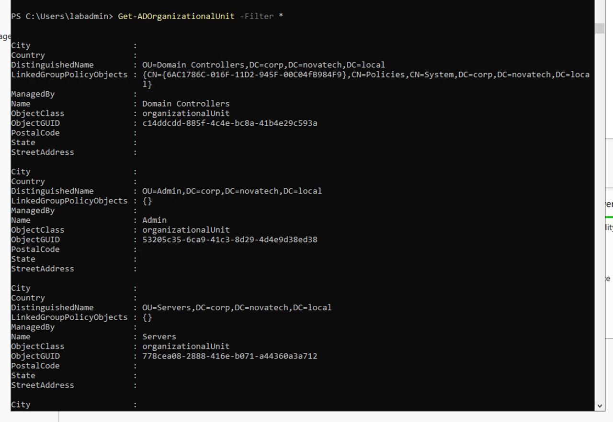

---

# PowerShell Automation

## Bulk User Creation

A PowerShell script was developed to automatically create Active Directory users from a CSV file.

**Script**

```
Scripts/BulkUserCreation.ps1
```

Script Preview

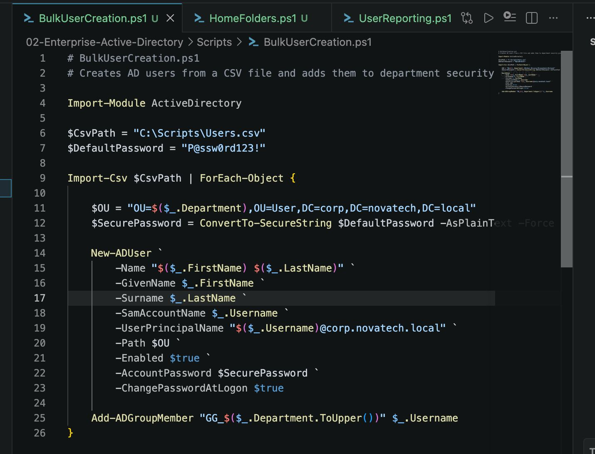

Execution

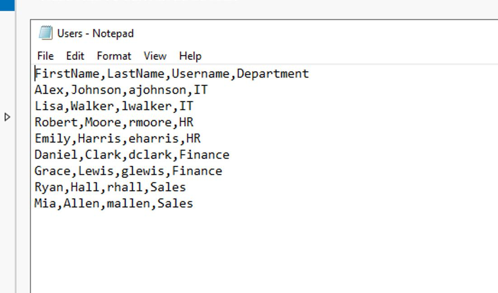

---

## Home Folder Configuration

PowerShell was used to automatically configure user home folders and assign permissions.

**Script**

```
Scripts/HomeFolders.ps1
```

Script Preview

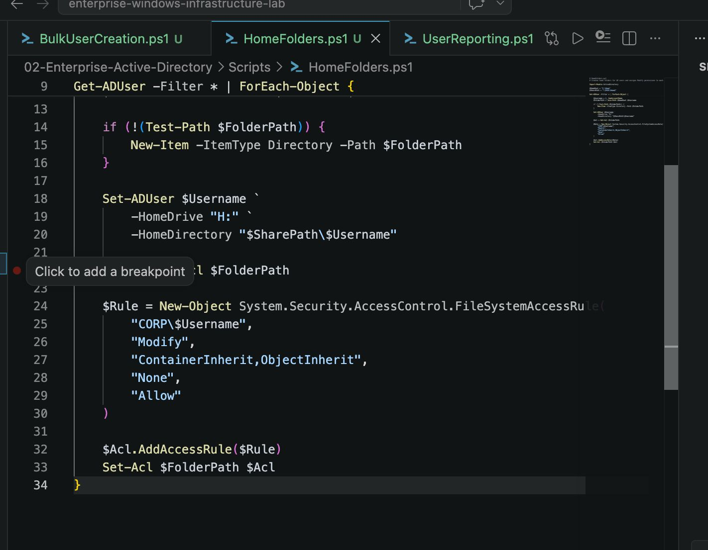

Execution

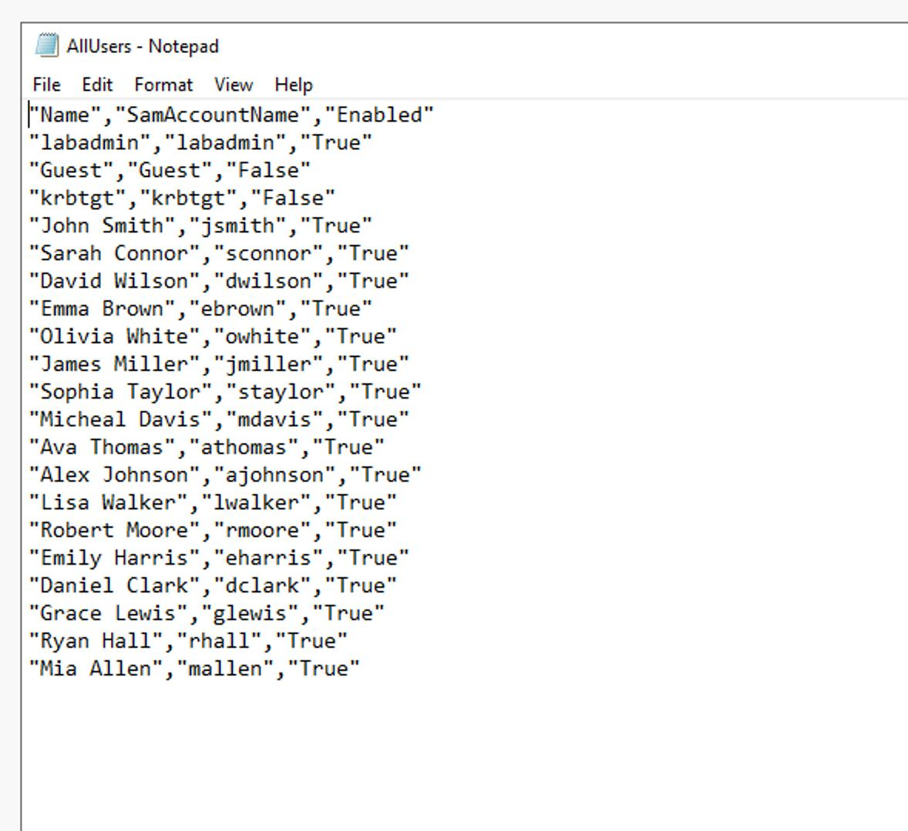

---

## Active Directory Reporting

PowerShell was used to generate reports for Active Directory users and groups.

**Script**

```
Scripts/UserReporting.ps1
```

Script Preview

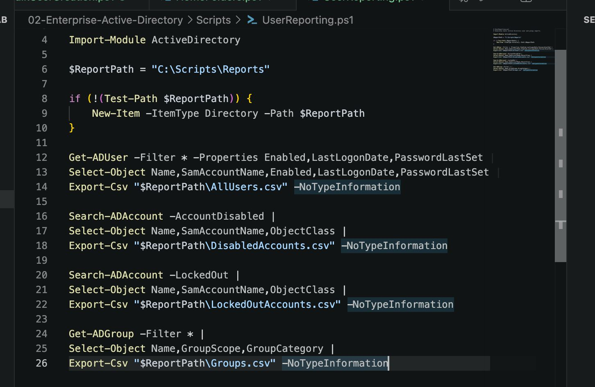

Execution

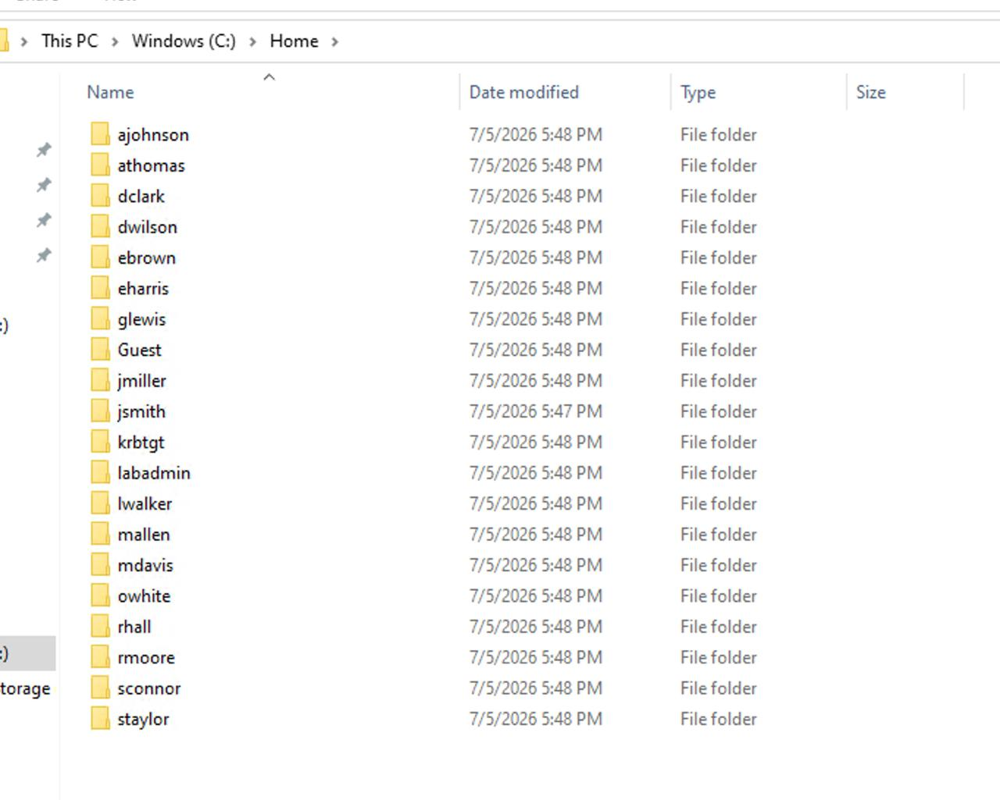

---

# Validation

The implementation was successfully validated by confirming:

- Active Directory Domain Services installation
- Domain Controller promotion
- Active Directory Users and Computers management console
- Organizational Unit creation
- Enterprise user creation
- PowerShell Active Directory queries
- Bulk user automation
- Home folder configuration
- Active Directory reporting

---

# Skills Demonstrated

- Windows Server Administration
- Active Directory Domain Services
- Domain Controller Deployment
- Organizational Unit Management
- User Administration
- PowerShell Automation
- Windows Scripting
- Active Directory Reporting
- Enterprise Documentation

---

# Scripts Included

| Script | Description |
|---------|-------------|
| BulkUserCreation.ps1 | Creates Active Directory users from a CSV file |
| HomeFolders.ps1 | Configures user home folders |
| UserReporting.ps1 | Generates Active Directory reports |

---

# Lessons Learned

This project provided hands-on experience deploying and administering an Enterprise Active Directory environment using Windows Server 2022. By combining graphical administration tools with PowerShell automation, repetitive administrative tasks were simplified while improving consistency, efficiency, and scalability.

---

# Next Project

## Project 03 – DNS & DHCP

The next phase of the lab will focus on implementing enterprise DNS and DHCP services, including Forward and Reverse Lookup Zones, DHCP Scopes, Reservations, Leases, and network troubleshooting.
<!-- Active Directory project documentation -->
