# Project 05 - Enterprise File Services

## Overview

This project demonstrates the deployment and administration of Windows Server File Services in an Active Directory environment. A centralized SMB file share was created and secured using Share and NTFS permissions. File Server Resource Manager (FSRM) was configured to implement storage quotas, file screening, and storage reporting. PowerShell was used to validate the SMB configuration.

---

# Objectives

- Create an enterprise SMB file share
- Configure Share Permissions
- Configure NTFS Permissions
- Configure Access-Based Enumeration (ABE)
- Configure Shadow Copies
- Install File Server Resource Manager (FSRM)
- Configure Disk Quotas
- Configure File Screening
- Generate Storage Reports
- Validate SMB shares using PowerShell

---

# Environment

| Component | Configuration |
|-----------|---------------|
| Operating System | Windows Server 2022 Datacenter |
| Domain | corp.novatech.local |
| Server | DC01 |
| Shared Folder | D:\CompanyData |
| Share Name | CompanyData$ |
| Management Tools | Server Manager, File Server Resource Manager |
| Validation | Windows PowerShell |

---

# Enterprise File Share

## CompanyData Folder

A dedicated shared folder was created on the D: volume to centrally store enterprise data.

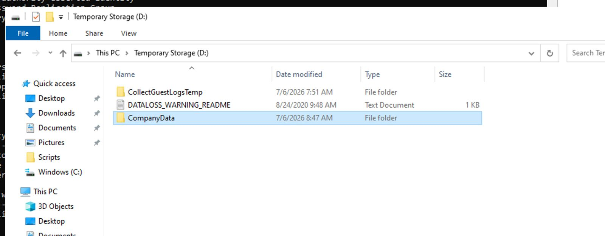

---

## Share Properties

The folder was shared as a hidden SMB share using the **$** suffix.

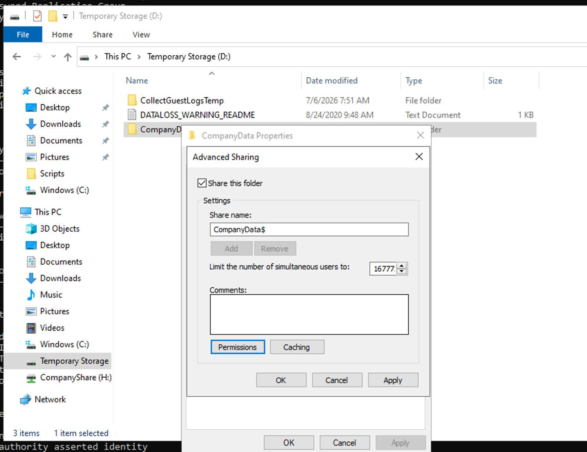

---

## Share Permissions

Share permissions were configured to control network access to the shared folder.

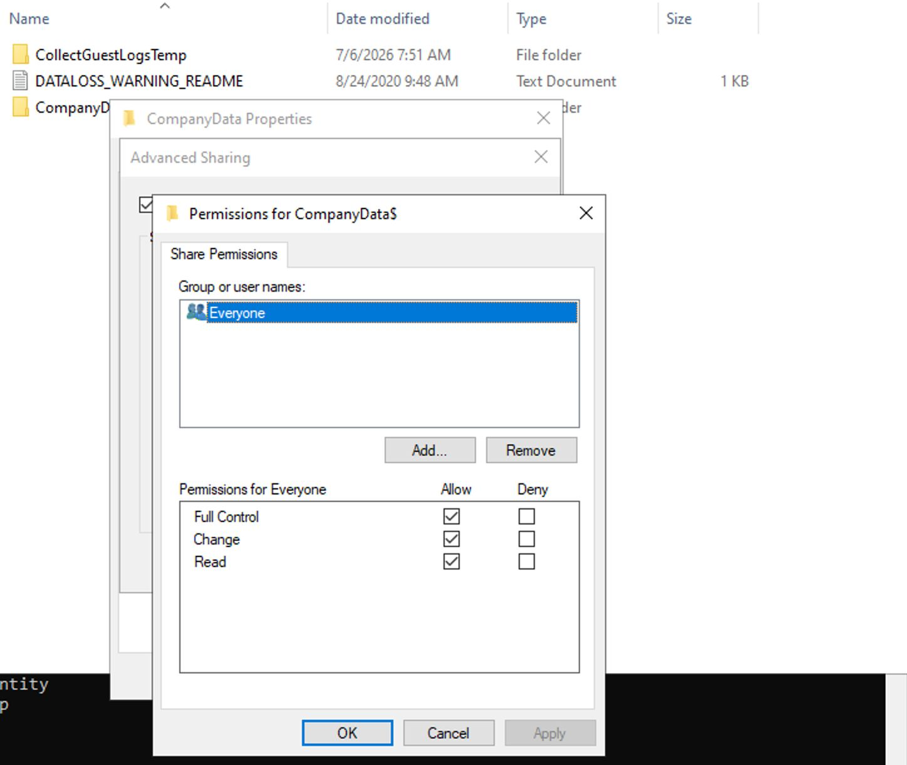

---

## NTFS Permissions

NTFS permissions were configured to secure access to the shared folder.

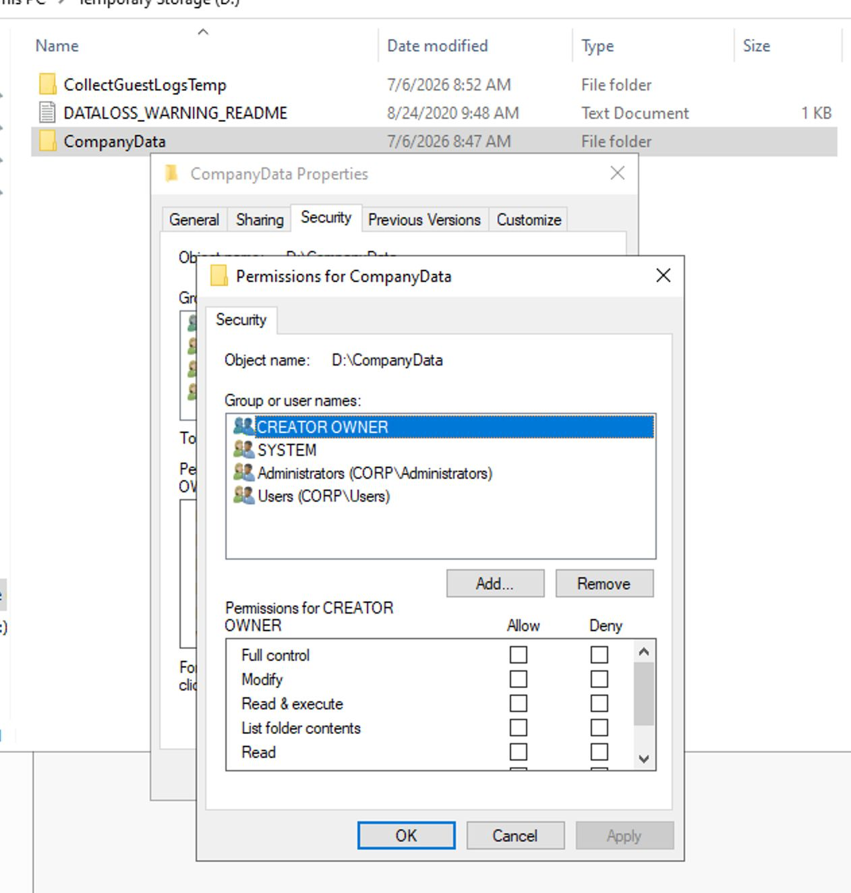

---

## Access-Based Enumeration

Access-Based Enumeration (ABE) was enabled to ensure users only see folders they have permission to access.

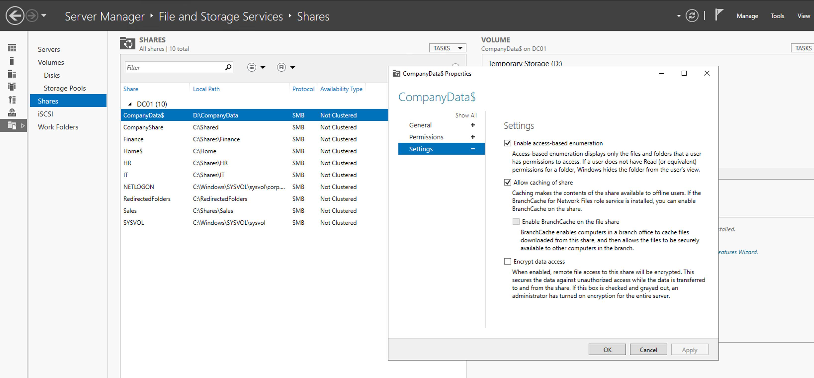

---

## Shadow Copies

Shadow Copies were configured to provide previous versions and assist with file recovery.

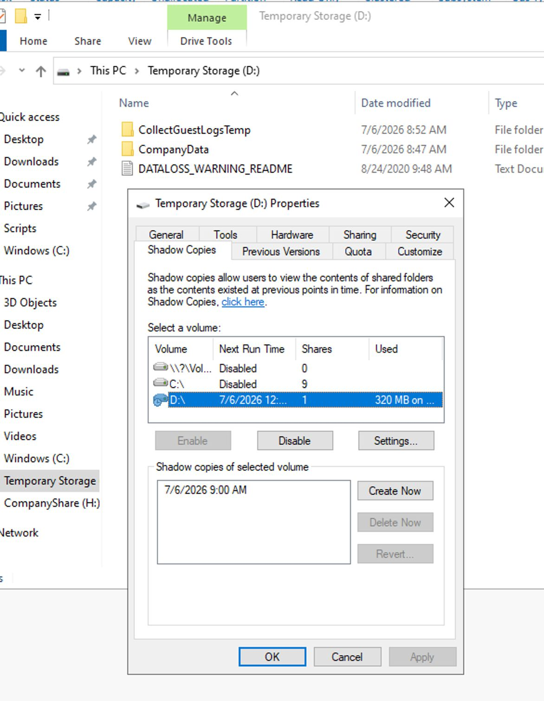

---

# File Server Resource Manager (FSRM)

## FSRM Installation

The File Server Resource Manager role was installed.

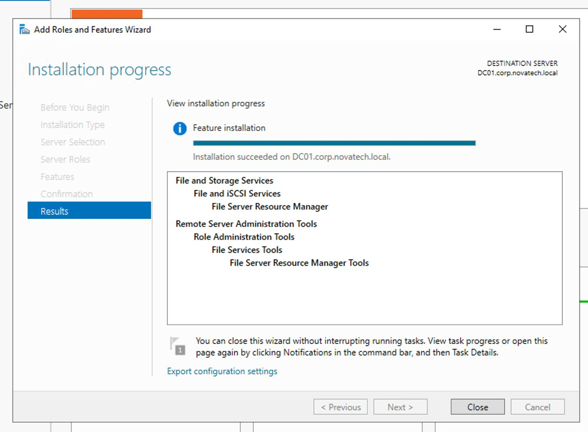

---

## Disk Quotas

Disk quotas were configured to control storage usage.

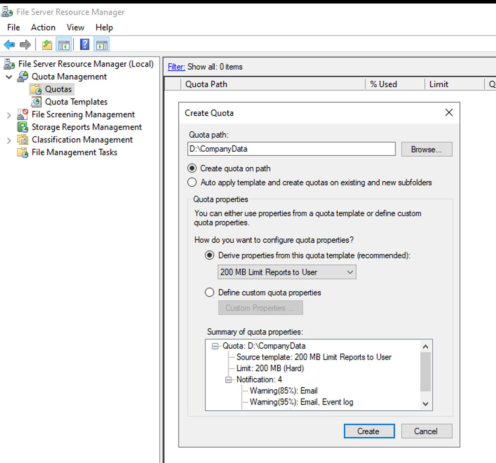

---

## File Screening

File Screening was configured to restrict selected file types.

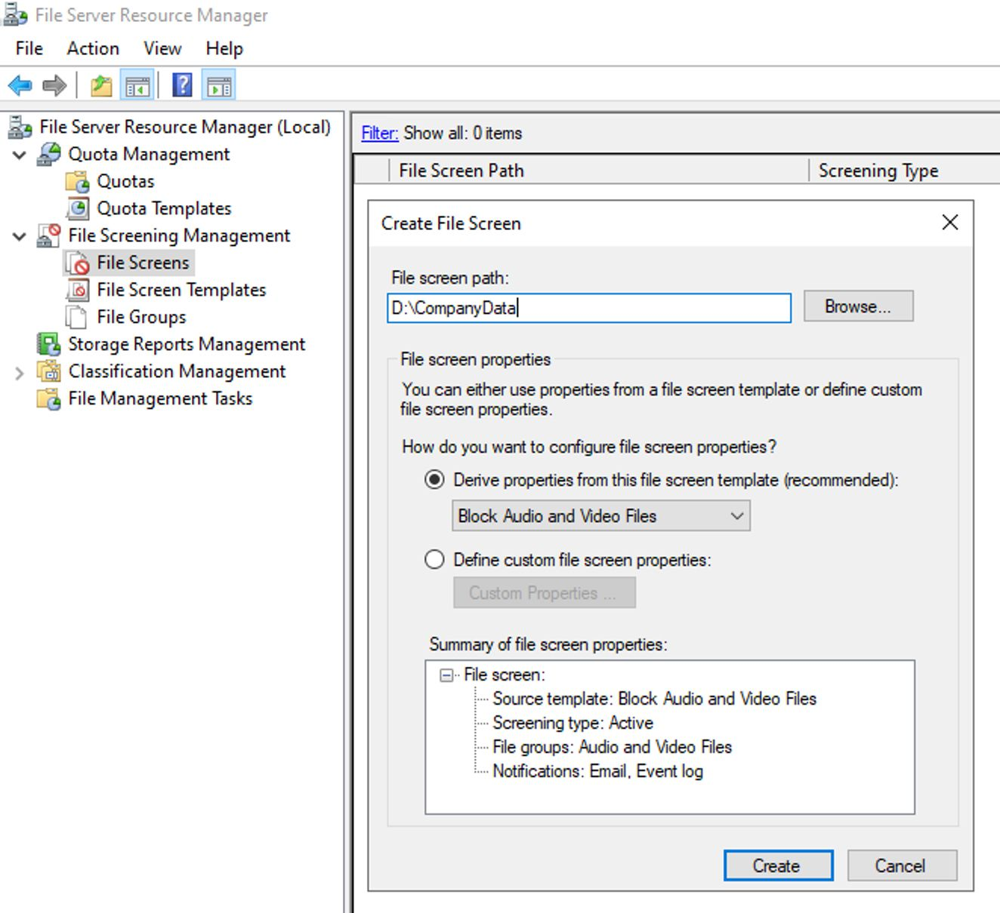

---

## Storage Reports

Storage Reports were generated to analyze storage utilization.

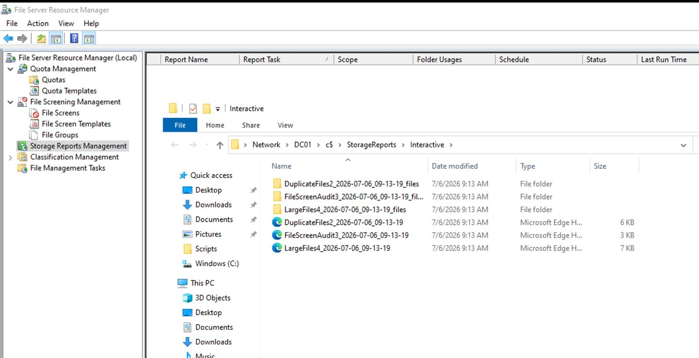

---

# Validation

## SMB Shares

PowerShell was used to verify the configured SMB shares.

```powershell
Get-SmbShare
```

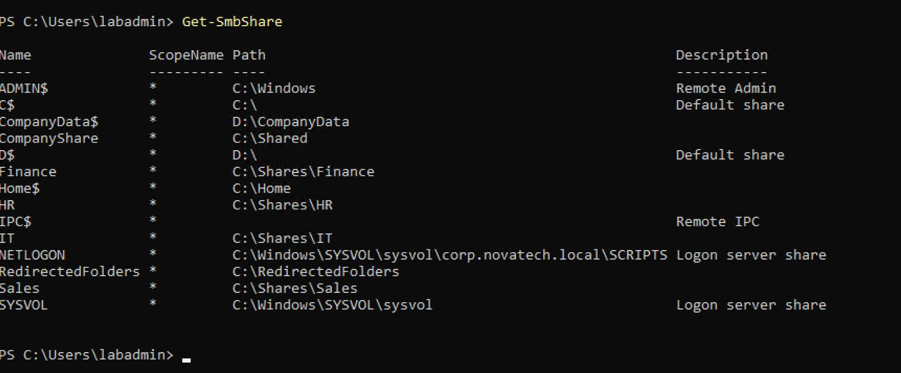

---

## SMB Share Permissions

PowerShell was used to verify permissions assigned to the CompanyData$ share.

```powershell
Get-SmbShareAccess -Name CompanyData$
```

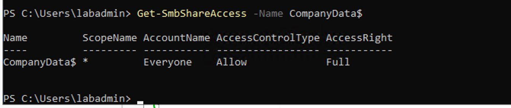

---

## Open SMB Files

PowerShell was used to verify active SMB file sessions.

```powershell
Get-SmbOpenFile
```

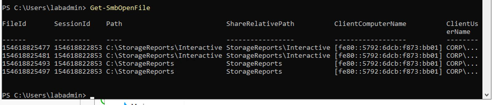

---

# Validation Summary

The deployment was successfully validated by confirming:

- SMB share creation
- Share permission configuration
- NTFS permission configuration
- Access-Based Enumeration configuration
- Shadow Copies configuration
- File Server Resource Manager installation
- Disk quota configuration
- File Screening configuration
- Storage Report generation
- SMB share validation using PowerShell

---

# Skills Demonstrated

- Windows Server Administration
- SMB File Sharing
- NTFS Permissions
- Share Permissions
- Access-Based Enumeration (ABE)
- Shadow Copies
- File Server Resource Manager (FSRM)
- Disk Quotas
- File Screening
- Storage Reporting
- PowerShell Administration

---

# Lessons Learned

This project provided hands-on experience implementing enterprise file services using Windows Server 2022. SMB shares were secured using Share and NTFS permissions, while Access-Based Enumeration, Shadow Copies, and File Server Resource Manager were configured to improve security, storage management, and administrative control. PowerShell cmdlets were used to validate the final configuration.

---

# Next Project

## Project 06 – Windows 11 Enterprise Client

The next project focuses on deploying a Windows 11 Enterprise client, joining it to the Active Directory domain, validating DNS and DHCP, applying Group Policies, testing Folder Redirection, and verifying enterprise file share access.